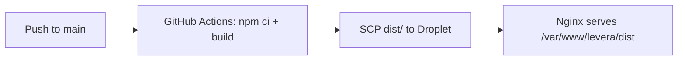

# Employee Management — Levera Technical Test

A simple web application for managing employee data (CRUD) with React, connected to MockAPI.

## Getting Started

```bash
npm install
npm run dev
```

Open [http://localhost:5173](http://localhost:5173) in your browser.

Production build:

```bash
npm run build
npm run preview
```

Lint:

```bash
npm run lint
```

## Deployment

Every push to the `main` branch automatically deploys the app to a DigitalOcean Droplet via GitHub Actions ([`.github/workflows/main.yml`](.github/workflows/main.yml)).



**Pipeline:**

1. **Trigger** — push to `main`
2. **Build** — GitHub Actions runs on `ubuntu-latest` with Node 20: `npm ci` then `npm run build`
3. **Deploy** — `appleboy/scp-action` uploads `dist/*` to `/var/www/levera/dist` on the Droplet via SSH
4. **Serve** — Nginx serves the static files from `/var/www/levera/dist` (with SPA fallback for React Router)

**Required GitHub Secrets:** `SSH_HOST`, `SSH_USER`, `SSH_KEY`

## Features

- **Employee list** — table with name, position, address, and created date
- **Search & filter** — name search (debounced 300ms) + position filter
- **Employee detail** — full detail page
- **Create / edit employee** — form with validation
- **Delete employee** — confirmation modal before deletion
- **Loading & error states** — clear feedback for every API operation
- **Pagination** — page navigation (server-side or client-side when position filter is active)

## Technical Decisions

### Vite + React + TypeScript

Vite was chosen for its fast dev server startup and built-in TypeScript support. TypeScript provides type safety for employee data models and API responses.

### TanStack Query (not Redux/Zustand)

This app is almost entirely concerned with **server state** (fetch, cache, invalidation after mutations). TanStack Query handles loading/error/retry/cache invalidation without Redux boilerplate. There is no complex global client state that requires a separate state manager.

### fetch (not axios)

MockAPI is simple enough; native `fetch` meets the requirements without an extra dependency. Error handling is centralized in `src/api/employeeApi.ts`.

### react-hook-form + zod

Declarative form validation with error messages in Indonesian. The zod schema is reusable and type-safe.

### Tailwind CSS

Utility-first CSS for responsive layouts and UI components quickly, without large separate CSS files.

### Search & position filter (hybrid)

MockAPI supports `?search=` and `?page=&limit=`, but does **not** support position filtering via query param.

- **Name search**: server-side via `?search=`
- **Position filter**: fetch up to 100 records, filter client-side, then paginate client-side
- **Without position filter**: server-side pagination (`page=1&limit=10`)

The position dropdown is populated from a separate query that fetches unique values from the API data.

## Project Structure

```
src/
├── api/           # Fetch wrappers + ApiError
├── components/    # UI & employee components
├── hooks/         # TanStack Query hooks
├── pages/         # Route pages
├── types/         # TypeScript interfaces
└── lib/           # Utilities
```

## API

Base URL: `https://65264556917d673fd76bec6f.mockapi.io/api/v1/employee`

## Tech Stack

- React 19 + Vite
- TypeScript
- react-router-dom
- TanStack Query
- react-hook-form + zod
- Tailwind CSS
